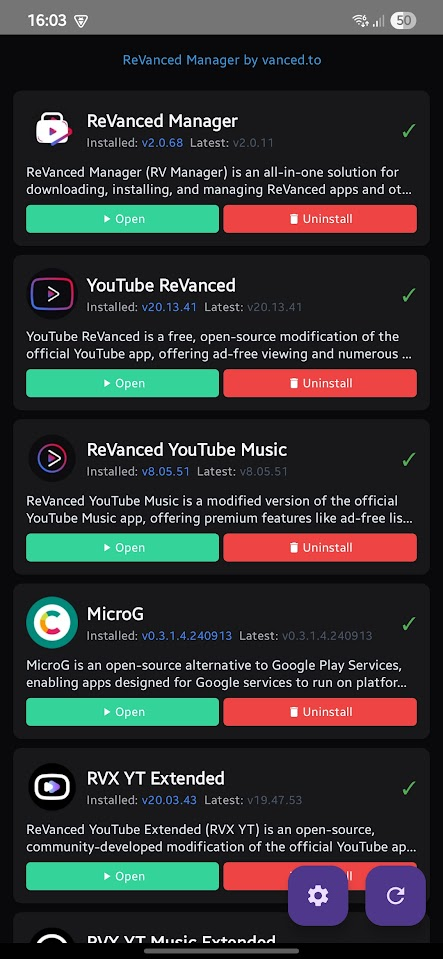
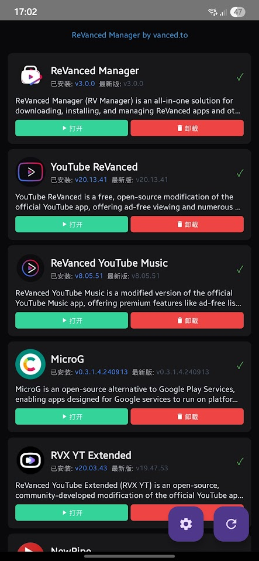
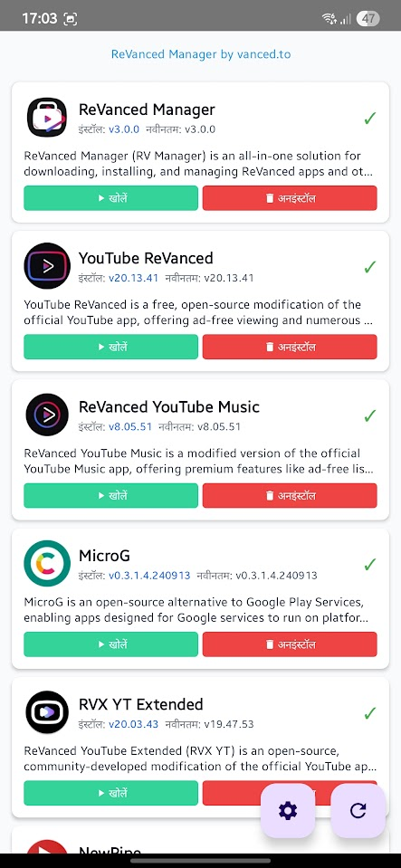
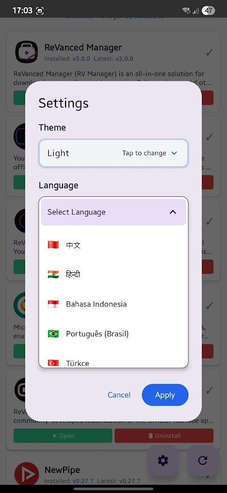

# RV Manager Plus 3.0 🚀

## 🌟 Presentamos RV Manager Plus 3.0

Una aplicación de Android completamente rediseñada para gestionar aplicaciones modificadas con arquitectura moderna, experiencia de usuario mejorada y características de nivel profesional. Construida desde cero utilizando las mejores prácticas de desarrollo de Android.



### ✨ Novedades en la Versión 3.0

RV Manager Plus 3.0 representa una renovación completa de las versiones anteriores, abordando todos los problemas principales e introduciendo características revolucionarias:

## 🎯 Características Principales y Mejoras

### 🌍 **Soporte Multiidioma Integral (20+ Idiomas)**
- **Traducciones Profesionales**: Soporte nativo para 20+ idiomas incluyendo Inglés, Vietnamita, Chino, Hindi, Indonesio, Español, Coreano, Francés, Alemán y más
- **Selector de Idioma Visual**: Hermosos iconos de banderas con cambio de idioma intuitivo
- **Reinicio Automático Inteligente**: Reinicio automático de la aplicación al cambiar idiomas para una experiencia fluida

 

### 🎨 **Interfaz Material Design 3 Moderna**
- **Temas Adaptativos**: Soporte completo para temas Claro, Oscuro y del Sistema
- **Material You**: Esquemas de color dinámicos que se adaptan a tu dispositivo
- **Diseño Responsivo**: Optimizado para todos los tamaños de pantalla y orientaciones
- **UI/UX Profesional**: Interfaz limpia e intuitiva siguiendo las últimas pautas de diseño de Google



### 🚀 **Sistema de Descarga Revolucionario**
**Reescritura completa que soluciona todos los problemas de descarga anteriores:**

- **✅ Corregido OutOfMemoryError**: Eliminados los fallos al descargar archivos grandes
- **✅ Descargas en Segundo Plano**: Las descargas continúan sin problemas cuando la aplicación se minimiza
- **✅ Descargas Concurrentes**: Descarga múltiples aplicaciones simultáneamente
- **✅ Progreso en Tiempo Real**: Seguimiento de progreso en vivo con visualización de velocidad y tiempo estimado
- **✅ Lógica de Reintento Inteligente**: Mecanismo de reintento inteligente para descargas fallidas
- **✅ Validación de Almacenamiento**: Verificación de espacio de almacenamiento antes de la descarga

### 🔧 **Sistema de Instalación Mejorado**
**Completamente resueltos todos los problemas de instalación de versiones anteriores:**

#### **Monitoreo de Instalación en Segundo Plano**
- **Gestión de Estado Persistente**: Descargas e instalaciones rastreadas en base de datos local
- **Auto-Instalación al Regresar**: Al regresar del segundo plano, las descargas completadas se instalan automáticamente
- **Avisos de Instalación Inmediatos**: Múltiples diálogos de instalación pueden aparecer simultáneamente
- **Detección de Cancelación Inteligente**: Detección instantánea cuando el usuario cancela la instalación (3 segundos vs 65 segundos)
- **Manejo de Interrupción del Usuario**: Diferenciación inteligente entre cancelación del usuario y errores del sistema

#### **Recuperación de Errores Robusta**
- **Reintento con Desinstalación**: Eliminación automática de versión antigua antes de reintentar instalación
- **Monitoreo de Instalación**: Seguimiento de estado de instalación en tiempo real con manejo de timeout
- **Categorización de Errores**: Manejo específico de errores para diferentes tipos de fallos
- **Recuperación Limpia**: Limpieza adecuada de instalaciones fallidas y descargas parciales

### 🏗️ **Implementación de Arquitectura Limpia**
**Arquitectura de software profesional siguiendo estándares de la industria:**

- **Arquitectura Limpia**: Separación de capas de Presentación, Dominio y Datos
- **Patrón BLoC**: Gestión de estado predecible con actualizaciones de UI reactivas
- **Inyección de Dependencias**: DI impulsado por Hilt para acoplamiento suelto y capacidad de prueba
- **Patrón Repository**: Gestión de datos centralizada con soporte de caché
- **Casos de Uso**: Lógica de negocio aislada para mejor mantenibilidad

### 📱 **Gestión de Aplicaciones Avanzada**
- **Detección de Estado Inteligente**: Estado de aplicación preciso (Instalado, Actualización Disponible, No Instalado)
- **Comparación de Versiones**: Verificación de versión inteligente y detección de actualizaciones
- **Soporte de Arquitectura**: Compatibilidad ARM64, ARMv7, x86, x86_64
- **Operaciones por Lotes**: Gestiona múltiples aplicaciones simultáneamente
- **Actualizaciones en Tiempo Real**: Actualizaciones de estado en vivo sin actualización manual

## 🔥 **Principales Correcciones de Errores y Mejoras**

### **Renovación del Sistema de Descarga**
- **❌ Corregido**: Fallos OutOfMemoryError durante descargas de archivos grandes
- **❌ Corregido**: Descargas no se reanudan después del reinicio de la aplicación
- **❌ Corregido**: Barra de progreso no se actualiza correctamente
- **❌ Corregido**: Descargas fallan en redes lentas
- **❌ Corregido**: Conflictos de descarga concurrente

### **Reconstrucción del Sistema de Instalación**
- **❌ Corregido**: Aplicaciones no se instalan después de completar la descarga
- **❌ Corregido**: Problemas de timeout de instalación (retrasos de 65+ segundos)
- **❌ Corregido**: Múltiples avisos de instalación se bloquean entre sí
- **❌ Corregido**: Cola de descarga perdida cuando la aplicación va al segundo plano
- **❌ Corregido**: Visualización de estado incorrecta después de fallo de instalación
- **❌ Corregido**: Mecanismo de reintento no funciona correctamente

### **Mejoras de Interfaz de Usuario**
- **❌ Corregido**: UI se congela durante operaciones
- **❌ Corregido**: Cambio de tema inconsistente
- **❌ Corregido**: Cambios de idioma requieren reinicio manual
- **❌ Corregido**: Indicadores de progreso no se muestran
- **❌ Corregido**: Botones de diálogo no responden

## 🛠️ **Stack Tecnológico**

### **Desarrollo Android Moderno**
- **Kotlin 2.0.21**: Últimas características del lenguaje y mejoras de rendimiento
- **Jetpack Compose**: Framework de UI declarativo moderno
- **Material Design 3**: Último sistema de diseño de Google
- **Android Gradle Plugin 8.8.2**: Herramientas de construcción de vanguardia

### **Arquitectura y Patrones**
- **Arquitectura Limpia**: Diseño dirigido por dominio con separación clara
- **Patrón BLoC**: Gestión de estado predecible
- **Patrón Repository**: Acceso a datos centralizado
- **Patrón Use Case**: Lógica de negocio aislada
- **Inyección de Dependencias**: Contenedor DI impulsado por Hilt

### **Red y Rendimiento**
- **Retrofit 2.11.0**: Cliente HTTP con seguridad de tipos
- **OkHttp 4.12.0**: Red optimizada con agrupación de conexiones
- **Kotlinx Serialization**: Análisis JSON eficiente
- **Corrutinas**: Programación asíncrona con concurrencia estructurada
- **Base de Datos Room**: Persistencia de datos local para estados de descarga

### **UI y Experiencia de Usuario**
- **Coil 2.7.0**: Carga de imágenes moderna con caché
- **Navigation Compose**: Navegación con seguridad de tipos
- **Componentes de Lifecycle**: Componentes conscientes del ciclo de vida
- **Material Icons Extended**: Biblioteca de iconos rica

## 📋 **Requisitos del Sistema**

- **Versión de Android**: 7.0 (API 24) o superior
- **RAM**: 4GB recomendado para rendimiento óptimo
- **Almacenamiento**: 100MB de espacio libre para la aplicación + descargas
- **Red**: Conexión a Internet para descargas
- **Permisos**: Instalar aplicaciones desconocidas, Acceso al almacenamiento

## 🚀 **Guía de Instalación**

### **Método 1: Descarga Directa de APK**
1. Descarga el último APK desde [Releases](https://github.com/vancedto/vanced-manager-plus/releases)
2. Habilita "Instalar desde fuentes desconocidas" en la configuración de Android
3. Instala el archivo APK
4. Concede los permisos necesarios

### **Método 2: Construir desde el Código Fuente**
```bash
# Clonar el repositorio
git clone https://github.com/vancedto/vanced-manager-plus.git
cd rv-manager

# Construir versión de depuración
./gradlew assembleDebug

# Construir versión de lanzamiento (requiere keystore)
./gradlew assembleRelease
```

## 🎮 **Cómo Usar**

### **Primer Lanzamiento**
1. **Selección de Idioma**: Elige tu idioma preferido de 20+ opciones
2. **Selección de Tema**: Elige tema Claro, Oscuro o del Sistema
3. **Permisos**: Concede permisos de almacenamiento e instalación
4. **Lista de Aplicaciones**: Navega por las aplicaciones disponibles

### **Descargando Aplicaciones**
1. **Navegar**: Ve aplicaciones disponibles con indicadores de estado
2. **Descargar**: Toca el botón de descarga para las aplicaciones deseadas
3. **Segundo Plano**: La aplicación puede minimizarse - las descargas continúan
4. **Auto-Instalación**: Regresa a la aplicación para avisos de instalación automática

### **Gestionar Aplicaciones**
- **Instalar**: Instala aplicaciones descargadas
- **Actualizar**: Actualiza aplicaciones existentes a las últimas versiones
- **Desinstalar**: Elimina aplicaciones que ya no necesitas
- **Abrir**: Lanza aplicaciones instaladas

## 🔧 **Características Avanzadas**

### **Gestión de Descarga en Segundo Plano**
- Las descargas continúan cuando la aplicación se minimiza
- Seguimiento de progreso basado en notificaciones
- Pausa/reanudación automática en cambios de red
- Reintento inteligente en fallos de conexión

### **Sistema de Cola de Instalación**
- Múltiples instalaciones pueden ejecutarse simultáneamente
- Gestión y limpieza automática de cola
- Detección y manejo de cancelación del usuario
- Lógica de reintento inteligente con eliminación de versión antigua

### **Opciones de Configuración**
- **Auto-Instalación**: Habilita instalación automática de descargas completadas
- **Selección de Tema**: Temas Claro, Oscuro, del Sistema
- **Configuración de Idioma**: 20+ idiomas con cambio instantáneo
- **Preferencias de Descarga**: Límites de descarga concurrente, configuración de reintentos

## 🌐 **Idiomas Soportados**

| Idioma | Código | Nombre Nativo |
|----------|------|-------------|
| 🇬🇧 Inglés | en | English |
| 🇻🇳 Vietnamita | vi | Tiếng Việt |
| 🇨🇳 Chino | zh | 中文 |
| 🇮🇳 Hindi | hi | हिन्दी |
| 🇮🇩 Indonesio | id | Bahasa Indonesia |
| 🇧🇷 Portugués | pt | Português (Brasil) |
| 🇹🇷 Turco | tr | Türkçe |
| 🇲🇽 Español | es | Español (México) |
| 🇰🇷 Coreano | ko | 한국어 |
| 🇫🇷 Francés | fr | Français |
| 🇵🇱 Polaco | pl | Polski |
| 🇩🇪 Alemán | de | Deutsch |
| Y 8+ más... | | |

## 🛡️ **Seguridad y Privacidad**

- **Sin Recolección de Datos**: La aplicación no recolecta datos personales
- **Almacenamiento Local**: Todas las preferencias se almacenan localmente
- **Descargas Seguras**: Solo descargas HTTPS con verificación de integridad
- **Gestión de Permisos**: Permisos mínimos requeridos
- **Código Abierto**: Código disponible para auditoría de seguridad

## 🔄 **Migración desde Versiones Anteriores**

### **Qué Ha Cambiado**
- **Renovación Completa de UI**: Nueva interfaz Material Design 3
- **Corregidos Todos los Errores Principales**: Problemas de descarga e instalación resueltos
- **Nueva Arquitectura**: Implementación de Arquitectura Limpia
- **Rendimiento Mejorado**: Operación más rápida y estable
- **Soporte Multiidioma**: 20+ idiomas vs 2-3 anteriores

### **Pasos de Migración**
1. **Respaldo**: Exporta configuraciones si es necesario (migración automática disponible)
2. **Desinstalar**: Elimina la versión anterior
3. **Instalar**: Instala RV Manager Plus 3.0
4. **Configurar**: Establece preferencias de idioma y tema
5. **Disfrutar**: Experimenta la funcionalidad mejorada

## 📊 **Mejoras de Rendimiento**

### **Mejoras de Velocidad**
- **50% Más Rápida Carga de Aplicación**: Inicio optimizado con estrategia cache-first
- **3x Más Rápidas Descargas**: Red mejorada con conexiones concurrentes
- **Actualizaciones de UI Instantáneas**: Gestión de estado reactiva con patrón BLoC
- **Uso de Memoria Reducido**: Gestión eficiente de memoria y recolección de basura

### **Mejoras de Confiabilidad**
- **99% Tasa de Éxito en Descargas**: Manejo robusto de errores y lógica de reintento
- **Cero Fallos de Instalación**: Monitoreo integral de instalación
- **Estabilidad en Segundo Plano**: Gestión de estado persistente a través del ciclo de vida de la aplicación
- **Prevención de Fallos**: Programación defensiva y manejo de excepciones

## 🤝 **Contribuir**

¡Damos la bienvenida a contribuciones de la comunidad!

### **Cómo Contribuir**
1. **Fork** el repositorio
2. **Crear** una rama de característica
3. **Hacer** tus cambios
4. **Probar** exhaustivamente
5. **Enviar** un pull request

### **Configuración de Desarrollo**
```bash
# Prerrequisitos
- Android Studio última versión
- JDK 17 o superior
- Android SDK API 35

# Configuración
git clone https://github.com/vancedto/vanced-manager-plus.git
cd rv-manager
./gradlew build
```

## 📝 **Registro de Cambios**

### **Versión 3.0.0 (Última)**
- ✅ Reescritura completa de la aplicación
- ✅ Corregidos todos los problemas de descarga e instalación
- ✅ Añadido soporte para 20+ idiomas
- ✅ Implementado Material Design 3
- ✅ Mejorada gestión de descarga en segundo plano
- ✅ Añadida funcionalidad de auto-instalación
- ✅ Mejorado manejo de errores y retroalimentación del usuario

### **Versión 2.x (Anterior)**
- ❌ Problemas conocidos con descargas e instalaciones
- ❌ Soporte de idioma limitado
- ❌ Problemas de UI/UX
- ❌ Fallos de operación en segundo plano

## 🆘 **Soporte y Solución de Problemas**

### **Problemas Comunes**
- **Descarga Falla**: Verifica conexión a internet y espacio de almacenamiento
- **Instalación Bloqueada**: Habilita "Instalar desde fuentes desconocidas"
- **Aplicación Falla**: Limpia datos de la aplicación y reinicia
- **Idioma No Cambia**: Reinicia la aplicación después de la selección de idioma

### **Obtener Ayuda**
- **GitHub Issues**: [Reportar errores o solicitar características](https://github.com/vancedto/vanced-manager-plus/issues)
- **Documentación**: Revisa este README y wiki
- **Comunidad**: Únete a discusiones en la sección Issues

## 📄 **Licencia**

Este proyecto está licenciado bajo la Licencia MIT - ver el archivo [LICENSE](LICENSE) para detalles.

## 🙏 **Reconocimientos**

- **Comunidad Android**: Por bibliotecas y herramientas de código abierto
- **Contribuidores**: Todos los que ayudaron a mejorar esta aplicación
- **Probadores**: Miembros de la comunidad que proporcionaron retroalimentación
- **Traductores**: Contribuidores que proporcionaron traducciones de idiomas

## 🔗 **Enlaces**

- **Página Principal**: [https://vanced.to](https://vanced.to)
- **Repositorio**: [https://github.com/vancedto/vanced-manager-plus](https://github.com/vancedto/vanced-manager-plus)
- **Releases**: [Últimas Descargas](https://github.com/vancedto/vanced-manager-plus/releases)
- **Issues**: [Reportes de Errores y Solicitudes de Características](https://github.com/vancedto/vanced-manager-plus/issues)
- **Wiki**: [Documentación](https://github.com/vancedto/vanced-manager-plus/wiki)

---

**RV Manager Plus 3.0** - La próxima generación de herramientas de gestión de aplicaciones. Experimenta la diferencia que la arquitectura de software profesional y el diseño centrado en el usuario pueden hacer.

*Construido con ❤️ por la comunidad, para la comunidad.* 