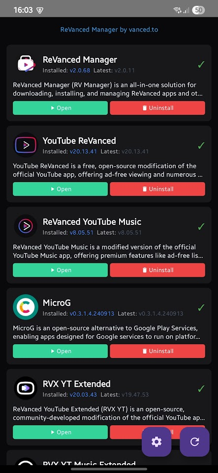
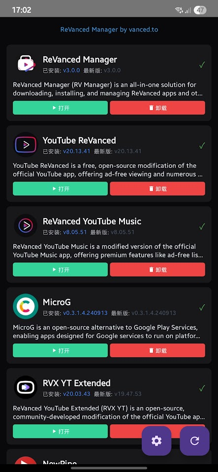
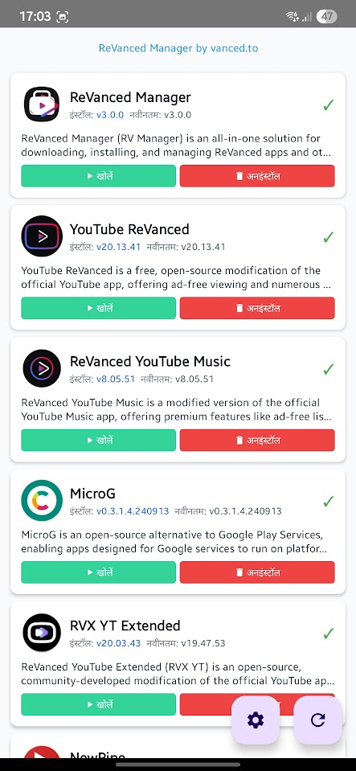
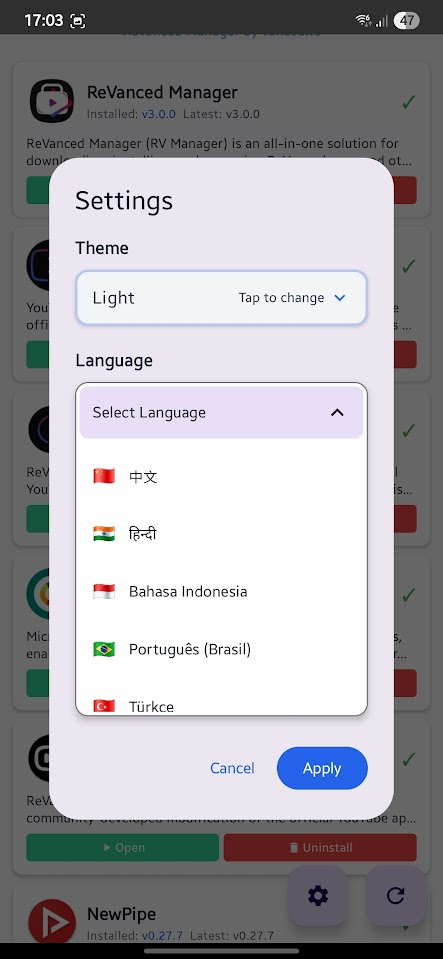

# RV Manager Plus 3.0 🚀

## 🌟 Présentation de RV Manager Plus 3.0

Une application Android entièrement repensée pour gérer les applications modifiées avec une architecture moderne, une expérience utilisateur améliorée et des fonctionnalités de niveau professionnel. Construite de zéro en utilisant les pratiques de développement Android les plus avancées.



### ✨ Nouveautés de la Version 3.0

RV Manager Plus 3.0 représente une refonte complète des versions précédentes, résolvant tous les problèmes majeurs et introduisant des fonctionnalités révolutionnaires :

## 🎯 Fonctionnalités Principales et Améliorations

### 🌍 **Support Multilingue Complet (20+ Langues)**
- **Traductions Professionnelles** : Support natif pour 20+ langues incluant Anglais, Vietnamien, Chinois, Hindi, Indonésien, Espagnol, Coréen, Français, Allemand et plus
- **Sélecteur de Langue Visuel** : Belles icônes de drapeaux avec changement de langue intuitif
- **Redémarrage Automatique Intelligent** : Redémarrage automatique de l'application lors du changement de langue pour une expérience fluide

 

### 🎨 **Interface Material Design 3 Moderne**
- **Thèmes Adaptatifs** : Support complet pour les thèmes Clair, Sombre et Système
- **Material You** : Schémas de couleurs dynamiques qui s'adaptent à votre appareil
- **Design Responsive** : Optimisé pour toutes les tailles d'écran et orientations
- **UI/UX Professionnelle** : Interface propre et intuitive suivant les dernières directives de design de Google



### 🚀 **Système de Téléchargement Révolutionnaire**
**Réécriture complète corrigeant tous les problèmes de téléchargement précédents :**

- **✅ Corrigé OutOfMemoryError** : Élimination des crashes lors du téléchargement de gros fichiers
- **✅ Téléchargements en Arrière-plan** : Les téléchargements continuent de manière fluide quand l'application est minimisée
- **✅ Téléchargements Concurrents** : Téléchargez plusieurs applications simultanément
- **✅ Progression en Temps Réel** : Suivi de progression en direct avec affichage de la vitesse et de l'ETA
- **✅ Logique de Retry Intelligente** : Mécanisme de retry intelligent pour les téléchargements échoués
- **✅ Validation du Stockage** : Vérification de l'espace de stockage avant téléchargement

### 🔧 **Système d'Installation Amélioré**
**Résolution complète de tous les problèmes d'installation des versions précédentes :**

#### **Surveillance d'Installation en Arrière-plan**
- **Gestion d'État Persistante** : Téléchargements et installations suivis dans la base de données locale
- **Auto-Installation au Retour** : Au retour de l'arrière-plan, les téléchargements terminés s'installent automatiquement
- **Invites d'Installation Immédiates** : Plusieurs dialogues d'installation peuvent apparaître simultanément
- **Détection d'Annulation Intelligente** : Détection instantanée quand l'utilisateur annule l'installation (3 secondes vs 65 secondes)
- **Gestion d'Abandon Utilisateur** : Différenciation intelligente entre annulation utilisateur et erreurs système

#### **Récupération d'Erreur Robuste**
- **Retry avec Désinstallation** : Suppression automatique de l'ancienne version avant retry d'installation
- **Surveillance d'Installation** : Suivi de statut d'installation en temps réel avec gestion de timeout
- **Catégorisation d'Erreurs** : Gestion d'erreur spécifique pour différents types d'échecs
- **Récupération Propre** : Nettoyage approprié des installations échouées et téléchargements partiels

### 🏗️ **Implémentation d'Architecture Propre**
**Architecture logicielle professionnelle suivant les standards de l'industrie :**

- **Architecture Propre** : Séparation des couches Présentation, Domaine et Données
- **Pattern BLoC** : Gestion d'état prévisible avec mises à jour UI réactives
- **Injection de Dépendances** : DI alimenté par Hilt pour couplage lâche et testabilité
- **Pattern Repository** : Gestion de données centralisée avec support de cache
- **Use Cases** : Logique métier isolée pour une meilleure maintenabilité

### 📱 **Gestion d'Applications Avancée**
- **Détection d'État Intelligente** : Statut d'application précis (Installé, Mise à jour Disponible, Non Installé)
- **Comparaison de Versions** : Vérification de version intelligente et détection de mises à jour
- **Support d'Architecture** : Compatibilité ARM64, ARMv7, x86, x86_64
- **Opérations par Lot** : Gérez plusieurs applications simultanément
- **Mises à jour en Temps Réel** : Mises à jour de statut en direct sans rafraîchissement manuel

## 🔥 **Corrections de Bugs Majeures et Améliorations**

### **Refonte du Système de Téléchargement**
- **❌ Corrigé** : Crashes OutOfMemoryError pendant les téléchargements de gros fichiers
- **❌ Corrigé** : Téléchargements ne reprenant pas après redémarrage de l'application
- **❌ Corrigé** : Barre de progression ne se mettant pas à jour correctement
- **❌ Corrigé** : Téléchargements échouant sur réseaux lents
- **❌ Corrigé** : Conflits de téléchargements concurrents

### **Reconstruction du Système d'Installation**
- **❌ Corrigé** : Applications ne s'installant pas après achèvement du téléchargement
- **❌ Corrigé** : Problèmes de timeout d'installation (délais de 65+ secondes)
- **❌ Corrigé** : Multiples invites d'installation se bloquant mutuellement
- **❌ Corrigé** : File d'attente de téléchargement perdue quand l'application va en arrière-plan
- **❌ Corrigé** : Affichage de statut incorrect après échec d'installation
- **❌ Corrigé** : Mécanisme de retry ne fonctionnant pas correctement

### **Améliorations d'Interface Utilisateur**
- **❌ Corrigé** : UI gelant pendant les opérations
- **❌ Corrigé** : Changement de thème incohérent
- **❌ Corrigé** : Changements de langue nécessitant un redémarrage manuel
- **❌ Corrigé** : Indicateurs de progression ne s'affichant pas
- **❌ Corrigé** : Boutons de dialogue ne répondant pas

## 🛠️ **Stack Technologique**

### **Développement Android Moderne**
- **Kotlin 2.0.21** : Dernières fonctionnalités du langage et améliorations de performance
- **Jetpack Compose** : Framework UI déclaratif moderne
- **Material Design 3** : Dernier système de design de Google
- **Android Gradle Plugin 8.8.2** : Outils de build de pointe

### **Architecture et Patterns**
- **Architecture Propre** : Design dirigé par le domaine avec séparation claire
- **Pattern BLoC** : Gestion d'état prévisible
- **Pattern Repository** : Accès aux données centralisé
- **Pattern Use Case** : Logique métier isolée
- **Injection de Dépendances** : Conteneur DI alimenté par Hilt

### **Réseau et Performance**
- **Retrofit 2.11.0** : Client HTTP type-safe
- **OkHttp 4.12.0** : Réseau optimisé avec pooling de connexions
- **Kotlinx Serialization** : Parsing JSON efficace
- **Coroutines** : Programmation asynchrone avec concurrence structurée
- **Base de Données Room** : Persistance de données locale pour états de téléchargement

### **UI et Expérience Utilisateur**
- **Coil 2.7.0** : Chargement d'images moderne avec cache
- **Navigation Compose** : Navigation type-safe
- **Composants Lifecycle** : Composants conscients du cycle de vie
- **Material Icons Extended** : Bibliothèque d'icônes riche

## 📋 **Exigences Système**

- **Version Android** : 7.0 (API 24) ou supérieur
- **RAM** : 4GB recommandé pour performance optimale
- **Stockage** : 100MB d'espace libre pour l'application + téléchargements
- **Réseau** : Connexion Internet pour les téléchargements
- **Permissions** : Installer applications inconnues, Accès au stockage

## 🚀 **Guide d'Installation**

### **Méthode 1 : Téléchargement Direct APK**
1. Téléchargez le dernier APK depuis [Releases](https://github.com/vancedapps/rv-manager/releases)
2. Activez "Installer depuis sources inconnues" dans les paramètres Android
3. Installez le fichier APK
4. Accordez les permissions nécessaires

### **Méthode 2 : Construire depuis le Code Source**
```bash
# Cloner le dépôt
git clone https://github.com/vancedapps/rv-manager.git
cd rv-manager

# Construire version debug
./gradlew assembleDebug

# Construire version release (nécessite keystore)
./gradlew assembleRelease
```

## 🎮 **Comment Utiliser**

### **Premier Lancement**
1. **Sélection de Langue** : Choisissez votre langue préférée parmi 20+ options
2. **Sélection de Thème** : Choisissez le thème Clair, Sombre ou Système
3. **Permissions** : Accordez les permissions de stockage et d'installation
4. **Liste d'Applications** : Parcourez les applications disponibles

### **Télécharger des Applications**
1. **Parcourir** : Voir les applications disponibles avec indicateurs de statut
2. **Télécharger** : Appuyez sur le bouton de téléchargement pour les applications désirées
3. **Arrière-plan** : L'application peut être minimisée - les téléchargements continuent
4. **Auto-Installation** : Revenez à l'application pour les invites d'installation automatique

### **Gérer les Applications**
- **Installer** : Installer les applications téléchargées
- **Mettre à jour** : Mettre à jour les applications existantes vers les dernières versions
- **Désinstaller** : Supprimer les applications dont vous n'avez plus besoin
- **Ouvrir** : Lancer les applications installées

## 🔧 **Fonctionnalités Avancées**

### **Gestion de Téléchargement en Arrière-plan**
- Les téléchargements continuent quand l'application est minimisée
- Suivi de progression basé sur notifications
- Pause/reprise automatique lors de changements réseau
- Retry intelligent lors d'échecs de connexion

### **Système de File d'Attente d'Installation**
- Plusieurs installations peuvent s'exécuter simultanément
- Gestion et nettoyage automatique de file d'attente
- Détection et gestion d'annulation utilisateur
- Logique de retry intelligent avec suppression d'ancienne version

### **Options de Configuration**
- **Auto-Installation** : Activer l'installation automatique des téléchargements terminés
- **Sélection de Thème** : Thèmes Clair, Sombre, Système
- **Paramètres de Langue** : 20+ langues avec changement instantané
- **Préférences de Téléchargement** : Limites de téléchargement concurrent, paramètres de retry

## 🌐 **Langues Supportées**

| Langue | Code | Nom Natif |
|----------|------|-------------|
| 🇬🇧 Anglais | en | English |
| 🇻🇳 Vietnamien | vi | Tiếng Việt |
| 🇨🇳 Chinois | zh | 中文 |
| 🇮🇳 Hindi | hi | हिन्दी |
| 🇮🇩 Indonésien | id | Bahasa Indonesia |
| 🇧🇷 Portugais | pt | Português (Brasil) |
| 🇹🇷 Turc | tr | Türkçe |
| 🇲🇽 Espagnol | es | Español (México) |
| 🇰🇷 Coréen | ko | 한국어 |
| 🇫🇷 Français | fr | Français |
| 🇵🇱 Polonais | pl | Polski |
| 🇩🇪 Allemand | de | Deutsch |
| Et 8+ de plus... | | |

## 🛡️ **Sécurité et Confidentialité**

- **Aucune Collecte de Données** : L'application ne collecte pas de données personnelles
- **Stockage Local** : Toutes les préférences sont stockées localement
- **Téléchargements Sécurisés** : Téléchargements HTTPS uniquement avec vérification d'intégrité
- **Gestion des Permissions** : Permissions minimales requises
- **Open Source** : Code disponible pour audit de sécurité

## 🔄 **Migration depuis les Versions Précédentes**

### **Ce Qui a Changé**
- **Refonte UI Complète** : Nouvelle interface Material Design 3
- **Corrigé Tous les Bugs Majeurs** : Problèmes de téléchargement et installation résolus
- **Nouvelle Architecture** : Implémentation d'Architecture Propre
- **Performance Améliorée** : Opération plus rapide et plus stable
- **Support Multilingue** : 20+ langues vs 2-3 précédentes

### **Étapes de Migration**
1. **Sauvegarde** : Exportez les paramètres si nécessaire (migration automatique disponible)
2. **Désinstaller** : Supprimez l'ancienne version
3. **Installer** : Installez RV Manager Plus 3.0
4. **Configurer** : Définissez les préférences de langue et thème
5. **Profiter** : Expérimentez la fonctionnalité améliorée

## 📊 **Améliorations de Performance**

### **Améliorations de Vitesse**
- **50% Plus Rapide Chargement d'Application** : Démarrage optimisé avec stratégie cache-first
- **3x Plus Rapides Téléchargements** : Réseau amélioré avec connexions concurrentes
- **Mises à jour UI Instantanées** : Gestion d'état réactive avec pattern BLoC
- **Usage Mémoire Réduit** : Gestion mémoire efficace et garbage collection

### **Améliorations de Fiabilité**
- **99% Taux de Succès Téléchargement** : Gestion d'erreur robuste et logique de retry
- **Zéro Échec d'Installation** : Surveillance d'installation complète
- **Stabilité Arrière-plan** : Gestion d'état persistante à travers le cycle de vie de l'application
- **Prévention de Crash** : Programmation défensive et gestion d'exceptions

## 🤝 **Contribuer**

Nous accueillons les contributions de la communauté !

### **Comment Contribuer**
1. **Fork** le dépôt
2. **Créer** une branche de fonctionnalité
3. **Faire** vos changements
4. **Tester** minutieusement
5. **Soumettre** une pull request

### **Configuration de Développement**
```bash
# Prérequis
- Android Studio dernière version
- JDK 17 ou supérieur
- Android SDK API 35

# Configuration
git clone https://github.com/vancedapps/rv-manager.git
cd rv-manager
./gradlew build
```

## 📝 **Journal des Modifications**

### **Version 3.0.0 (Dernière)**
- ✅ Réécriture complète de l'application
- ✅ Corrigé tous les problèmes de téléchargement et installation
- ✅ Ajouté support pour 20+ langues
- ✅ Implémenté Material Design 3
- ✅ Amélioré la gestion de téléchargement en arrière-plan
- ✅ Ajouté fonctionnalité d'auto-installation
- ✅ Amélioré gestion d'erreurs et feedback utilisateur

### **Version 2.x (Précédente)**
- ❌ Problèmes connus avec téléchargements et installations
- ❌ Support de langue limité
- ❌ Problèmes UI/UX
- ❌ Échecs d'opération en arrière-plan

## 🆘 **Support et Dépannage**

### **Problèmes Communs**
- **Téléchargement Échoue** : Vérifiez connexion internet et espace de stockage
- **Installation Bloquée** : Activez "Installer depuis sources inconnues"
- **Application Crash** : Videz les données de l'application et redémarrez
- **Langue Ne Change Pas** : Redémarrez l'application après sélection de langue

### **Obtenir de l'Aide**
- **GitHub Issues** : [Signaler bugs ou demander fonctionnalités](https://github.com/vancedapps/rv-manager/issues)
- **Documentation** : Consultez ce README et wiki
- **Communauté** : Rejoignez discussions dans section Issues

## 📄 **Licence**

Ce projet est sous licence MIT - voir le fichier [LICENSE](LICENSE) pour détails.

## 🙏 **Remerciements**

- **Communauté Android** : Pour les bibliothèques et outils open source
- **Contributeurs** : Tous ceux qui ont aidé à améliorer cette application
- **Testeurs** : Membres de la communauté qui ont fourni des retours
- **Traducteurs** : Contributeurs qui ont fourni des traductions de langues

## 🔗 **Liens**

- **Page d'Accueil** : [https://vanced.to](https://vanced.to)
- **Dépôt** : [https://github.com/vancedapps/rv-manager](https://github.com/vancedapps/rv-manager)
- **Releases** : [Derniers Téléchargements](https://github.com/vancedapps/rv-manager/releases)
- **Issues** : [Signalement de Bugs & Demandes de Fonctionnalités](https://github.com/vancedapps/rv-manager/issues)
- **Wiki** : [Documentation](https://github.com/vancedapps/rv-manager/wiki)

---

**RV Manager Plus 3.0** - La prochaine génération d'outils de gestion d'applications. Expérimentez la différence que l'architecture logicielle professionnelle et le design centré utilisateur peuvent faire.

*Construit avec ❤️ par la communauté, pour la communauté.* 